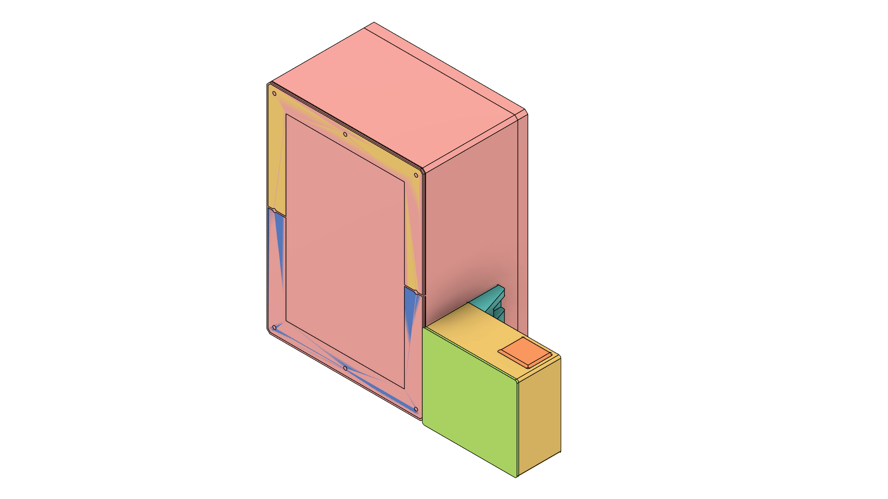
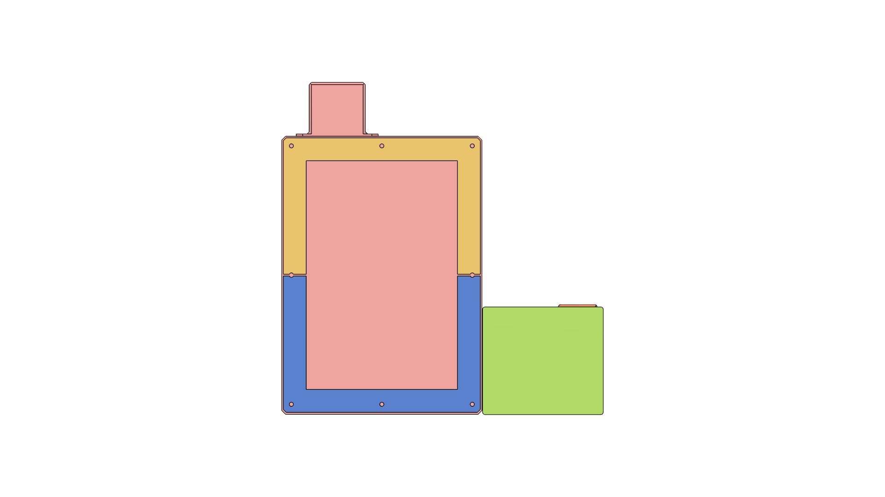
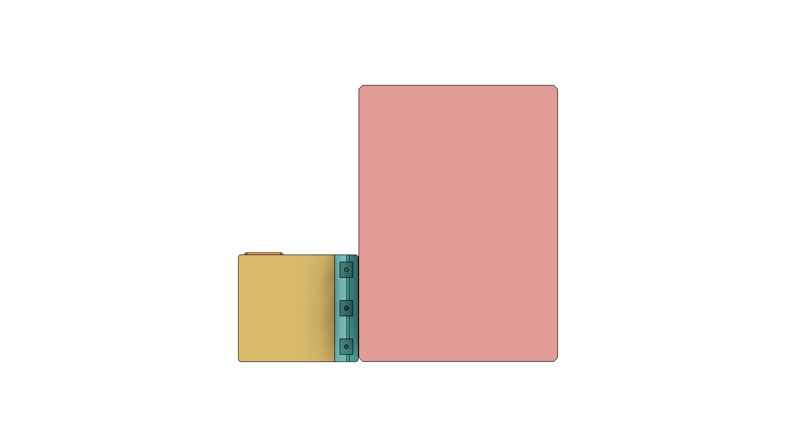
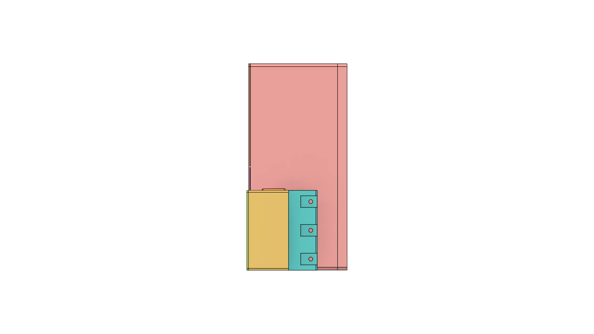
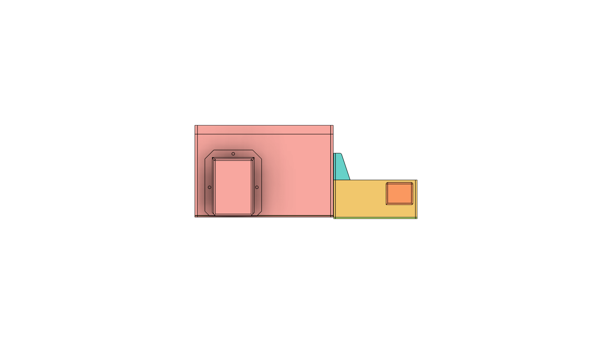
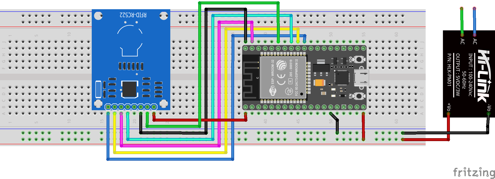

# ToolEase

**A modern, open-source RFID-based tool leasing and inventory management system for educational, industrial, and makerspace environments.**

---

## Table of Contents

- [Overview](#overview)
- [Key Features](#key-features)
- [System Architecture](#system-architecture)
- [Hardware Requirements](#hardware-requirements)
- [Wiring Diagram](#wiring-diagram)
- [Software Dependencies](#software-dependencies)
- [Installation & Setup](#installation--setup)
- [Configuration](#configuration)
- [Operation Guide](#operation-guide)
- [API & Communication](#api--communication)
- [Testing & Validation](#testing--validation)
- [Troubleshooting](#troubleshooting)
- [Project Structure](#project-structure)
- [Future Enhancements](#future-enhancements)
- [Contributing](#contributing)
- [Support & Contact](#support--contact)
- [License](#license)

---


## Overview

ToolEase is a complete IoT solution for managing tool lending, inventory, and asset tracking. It combines a robust Flutter mobile app with an ESP32-based RFID hardware interface, enabling real-time, per-unit tracking of tools and equipment. Designed for schools, universities, workshops, and industrial settings, ToolEase streamlines the process of borrowing, returning, and maintaining tools, ensuring accountability and reducing loss.

**Why ToolEase?**
- Eliminate manual logbooks and spreadsheets
- Prevent tool loss and unauthorized borrowing
- Gain real-time visibility into inventory and usage
- Simplify reporting and compliance

---

## Key Features

- **Per-Unit RFID Tracking:** Every tool is uniquely tagged and tracked
- **Student & User Management:** Register, search, and manage borrowers
- **Multi-Storage Support:** Organize tools by location or cabinet
- **Borrow/Return Workflow:** Scan to borrow, scan to return, with condition assessment
- **Admin Dashboard:** Real-time stats, PDF reports, and analytics
- **Kiosk Mode:** Secure, tablet-optimized interface for public use
- **Offline Operation:** Local database ensures reliability without internet
- **Auto-Reconnect:** Robust WiFi/WebSocket connection with status feedback
- **Security:** Biometric/PIN admin access, audit logs, and session management

---

## System Architecture

```
┌───────────────┐    WebSocket    ┌───────────────┐
│  Flutter App  │◄──────────────►│    ESP32      │
│   (Tablet)    │                │  (RFID HW)    │
│               │                │               │
│ • UI/UX       │                │ • MFRC522     │
│ • SQLite DB   │                │ • WiFi AP     │
│ • WebSocket   │                │ • AsyncServer │
└───────────────┘                └───────────────┘
     │                                 │
     ▼                                 ▼
   Students, Admins                  RFID Tags
```

---

## Hardware Requirements

- **ESP32 Dev Board** (WROOM-32 or similar)
- **MFRC522 RFID Module** (SPI interface)
- **RFID Tags/Cards** (MIFARE Classic 1K/4K, NTAG)
- **Tablet/Android Device** (with WiFi, running Flutter app)
- **Power Supply** (USB or battery, 500mA+)

---


## Physical Assembly & Views

ToolEase is designed for robust, real-world deployment. Below are detailed renders and diagrams to guide you through the assembly, wiring, and enclosure design. Each view and diagram is provided to ensure clarity for both hardware assembly and troubleshooting.

### Full Device Views

#### Complete Assembly (All Angles)

<p align="center">
  
</p>

This render shows the fully assembled ToolEase device, including the ESP32, RFID module, and all enclosure parts. Use this as a reference for the final look and for verifying that all components are properly housed.

#### Front View
<p align="center">
  
</p>
The front view highlights the RFID scan area, user interface, and any status indicators. This is the main interaction side for users.

#### Back View
<p align="center">
  
</p>
The back view shows cable management, mounting options, and access to the ESP32 board for maintenance.

#### Side View
<p align="center">
  
</p>
The side profile demonstrates the device’s thickness, bracket placement, and ventilation if present.

#### Top View
<p align="center">
  
</p>
The top view is useful for understanding the layout of ports, buttons, and the RFID antenna’s position.

### 3D Printed Parts & Covers

- **Board Case:** 
- **Bracket:** 
- **Case Cover:** 
- **Tablet Cover:** 
- **Port Cover:** 
- **All Parts Joined:** 

Each part is designed for easy 3D printing and assembly. The covers and brackets ensure protection, stability, and a professional finish for the device.

### Wiring Diagram & Fritzing

#### Visual Wiring Diagram
<p align="center">
  
</p>
This diagram provides a clear, color-coded map of all connections between the ESP32 and MFRC522 RFID module. Double-check your wiring against this image before powering on.

#### Fritzing Source File
- [Download Wiring.fzz](wiring/Wiring.fzz)

The Fritzing file allows you to view, edit, or print the wiring diagram using the Fritzing app. This is ideal for customizing the hardware layout or troubleshooting.

---

## Software Dependencies

### Flutter App
- Flutter SDK 3.8+
- Dart SDK 3.0+
- Riverpod, Drift ORM, Material 3, PDF, Kiosk Mode, Local Auth, Permission Handler

### ESP32 Firmware
- Arduino IDE 1.8+
- ESP32 Arduino Core v2.0.14
- ESPAsyncWebServer, AsyncTCP, EasyMFRC522

---

## Installation & Setup

### ESP32 Setup
1. Open Arduino IDE
2. Load `source/esp32/Toolease/Toolease.ino`
3. Select **ESP32 Dev Module** (Board Manager: v2.0.14 recommended)
4. Install libraries: ESPAsyncWebServer, AsyncTCP, EasyMFRC522
5. Upload firmware
6. Open Serial Monitor (115200 baud)
7. Confirm: "Access Point started" and "IP Address: 192.168.4.1"

### Flutter App Setup
1. Clone repository: `git clone https://github.com/qppd/Toolease.git`
2. `cd Toolease/source/flutter/Toolease`
3. Install dependencies: `flutter pub get`
4. Build and run: `flutter run` or `flutter build apk --release`
5. Install APK on tablet

### Connect Tablet to ESP32 WiFi
1. Settings → WiFi → Connect to `ToolEase_RFID` (password: `toolease123`)
2. Ignore "No internet" warning, turn OFF mobile data
3. Open ToolEase app, wait for green WiFi icon

---

## Configuration

### Flutter App
- Kiosk mode, feature toggles, biometric/PIN admin access, WebSocket server settings

### ESP32
- WiFi credentials, RFID pin assignments, WebSocket port (default 81), debug level

### Database
- Auto-migrates on first run; settings and admin credentials configurable in-app

---

## Operation Guide

### For Students
1. Register via app, enter details
2. Borrow: select item, scan RFID tag
3. Return: select item, scan RFID, assess condition

### For Admins
1. Authenticate, manage students/items/storages
2. Assign RFID tags, generate reports, configure settings

### RFID Workflow
1. Assign tag: admin selects item, places tag on reader, app writes data
2. Borrow: student scans tag, app records transaction
3. Return: scan tag, record condition

---

## API & Communication

### WebSocket Protocol
- **ESP32 → App:** `{ "action": "rfid_scan", "uid": "A1:B2:C3:D4:E5:F6" }`
- **App → ESP32:** `{ "action": "write_tag", "data": "item_id:unit_id" }`

### Database API
- Full CRUD for all entities, atomic transactions, real-time queries, advanced search/filter

### Serial Commands (ESP32)
- `test`, `scan <uid>`, `help`

---

## Testing & Validation

- Follow Quick Start and WiFi Setup
- Upload ESP32 firmware, verify AP
- Build/install app, connect to WiFi
- Test RFID scan, borrow/return, admin dashboard
- Simulate disconnects, test auto-reconnect
- Use Serial Monitor and Flutter DevTools for debugging

---

## Troubleshooting

| Issue | Solution |
|-------|----------|
| No WiFi network | ESP32 powered on? Serial Monitor shows AP? |
| Can't connect WiFi | Correct password? Mobile data OFF? |
| Red WiFi icon | Wait 3s for auto-reconnect. Check Serial Monitor. |
| Scan timeout | Green WiFi icon? Hold tag close to reader? |
| Connection drops | Move closer to ESP32. Check for interference. |

See full section above for detailed troubleshooting.

---

## Project Structure

```
Toolease/
├── LICENSE
├── README.md
├── models/           # 3D printable parts
├── source/
│   ├── esp32/
│   │   └── Toolease/ (firmware)
│   └── flutter/
│       └── Toolease/ (Flutter app)
└── wiring/           # Hardware diagrams
```

---

## Future Enhancements

- Cloud sync for multi-device
- Barcode/QR code support
- Advanced analytics and reporting
- Maintenance scheduling
- Mobile app for students
- Multi-location, centralized management
- AI-powered predictive maintenance

---

## Contributing

We welcome contributions! Please fork, create a feature branch, commit, and open a pull request. See code standards and dev setup in the repo.

---

## Support & Contact

- **Developer:** Quezon Province Provincial Developer
- **Email:** quezon.province.pd@gmail.com
- **Portfolio:** [sajed-mendoza.onrender.com](https://sajed-mendoza.onrender.com)
- **GitHub:** [qppd](https://github.com/qppd)
- **Facebook:** [qppd.dev](https://facebook.com/qppd.dev)

---

## License

MIT License. See [LICENSE](LICENSE) for details.


## 🚀 Quick Start

### ESP32 Setup
1. Open Arduino IDE
2. Load `source/esp32/Toolease/Toolease.ino`
3. Select **ESP32 Dev Module** (Board Manager: v2.0.14 recommended)
4. Install libraries: **ESPAsyncWebServer**, **AsyncTCP**, **EasyMFRC522**
5. Upload firmware
6. Open Serial Monitor (115200 baud)
7. You should see:
   - `Access Point started`
   - `IP Address: 192.168.4.1`
   - `WebSocket server started on port 80 at /ws`

### Tablet Setup
1. Connect to WiFi: `ToolEase_RFID` (password: `toolease123`)
2. Ignore "No internet" warning
3. Turn OFF mobile data
4. Open ToolEase app
5. Wait for **green WiFi icon**

### Usage
- **Green WiFi icon** = Connected
- **Red WiFi-off icon** = Not connected
- **RFID scanning** = Hold tag near RC522 for 1-2 seconds

### WiFi/WebSocket Details
```
SSID: ToolEase_RFID
Password: toolease123
IP: 192.168.4.1
WebSocket URL: ws://192.168.4.1/ws
```

---


## WiFi & WebSocket Setup

- ESP32 creates a WiFi Access Point (`ToolEase_RFID`)
- Tablet connects to ESP32 WiFi
- Communication is via WebSocket (`ws://192.168.4.1/ws`)
- No Bluetooth required
- Auto-reconnect and error handling built-in

**Troubleshooting:**
| Problem | Solution |
|---------|----------|
| No WiFi network | Restart ESP32, check Serial Monitor |
| Can't connect | Double-check password, turn off mobile data |
| Red WiFi icon | Wait 3 seconds for auto-reconnect |
| Scan timeout | Ensure green WiFi icon before scanning |
| Still not working? | Re-upload firmware, check library versions |

---

## System Features

- **Per-Unit RFID Tracking**: Every tool has a unique RFID tag (Serial No.)
- **Student Registration & Management**: Register students with ID, name, year, section
- **Storage Organization**: Manage multiple storage locations
- **Item Inventory**: Add/edit tools, assign RFID, track status (available, borrowed, lost, damaged)
- **Borrow/Return Workflow**: Scan to borrow, scan to return, condition tracking
- **Admin Panel**: Secure PIN/biometric access, real-time stats, PDF reports
- **Kiosk Mode**: Tablet-optimized, restricted navigation
- **Auto-Reconnect**: WiFi/WebSocket auto-reconnect for reliability

---

## Database & Code Structure

### Database
- **SQLite with Drift ORM**
- Per-unit item tracking (no more quantity fields)
- Borrow/return records linked to unique Serial No.

### Code Structure
- `lib/` (Flutter app)
   - `core/`, `database/`, `models/`, `providers/`, `screens/`, `services/`, `shared/`, `utils/`
- `source/esp32/Toolease/` (ESP32 firmware)
   - `Toolease.ino`, `Websocket_Config.cpp/.h`, `Rfid_Config.cpp/.h`

### ESP32 Pinout
```
ESP32       RC522
GPIO 5   -> SDA (SS)
GPIO 18  -> SCK
GPIO 23  -> MOSI
GPIO 19  -> MISO
GPIO 21  -> RST
3.3V     -> 3.3V
GND      -> GND
```

---

## Deployment & Testing

### Pre-Deployment Checklist
- [ ] ESP32 firmware uploaded, Serial Monitor shows correct logs
- [ ] Tablet connects to `ToolEase_RFID`, mobile data OFF
- [ ] ToolEase app installed, green WiFi icon appears
- [ ] RFID scan works for borrow/return
- [ ] Admin panel accessible, reports generate

### Build & Install
- `flutter pub get`
- `flutter run` or `flutter build apk --release`
- Install APK on tablet

### Testing
- Borrow/return workflow
- Student registration
- Admin dashboard
- Error handling (disconnect WiFi, scan timeout)

---

## Troubleshooting

**Common Issues:**
- ESP32 not creating WiFi: Check power, re-upload firmware
- Tablet won’t connect: Double-check password, mobile data OFF
- App not connecting: Confirm WebSocket URL is `ws://192.168.4.1/ws`
- Scan timeout: Ensure green WiFi icon, hold tag for 1-2 seconds
- Still stuck? Downgrade ESP32 core to 2.0.14, reinstall libraries

**Debug Tools:**
- Serial Monitor (ESP32)
- Flutter DevTools
- Network tools (ping, WebSocket test apps)

---

## Migration & Changelog

- Bluetooth code and dependencies **fully removed**
- ESP32 now uses **ESPAsyncWebServer** + **AsyncTCP** for WebSocket
- WebSocket URL changed to `ws://192.168.4.1/ws` (port 80)
- All Flutter code uses WebSocket only
- Per-unit RFID tracking, no more quantity fields
- All documentation merged into this README

---

## License

MIT License. See [LICENSE](LICENSE) for details.
- **Borrowing System**: Multi-storage, multi-item borrowing with real-time availability checking
- **Return Processing**: Condition-based return tracking (good, damaged, lost) for each item unit
- **Real-time Synchronization**: WebSocket-based communication between mobile app and RFID hardware

### Administrative Features
- **Admin Dashboard**: Real-time statistics and system overview
- **User Management**: Student registration and profile management
- **Inventory Control**: Comprehensive item and storage management
- **Transaction Records**: Complete borrowing history with archiving capabilities
- **Reporting System**: Generate PDF reports for inventory status and usage analytics
- **System Settings**: Configurable feature toggles and kiosk mode

### Hardware Integration
- **RFID Reading/Writing**: MFRC522-based tag detection and data storage
- **WiFi Connectivity**: Access Point and Station modes for flexible networking
- **WebSocket Server**: Real-time bidirectional communication
- **Serial Debugging**: Command-line interface for testing and diagnostics

### User Experience
- **Kiosk Mode**: Lockdown interface for public use scenarios
- **Biometric Authentication**: Local authentication for admin access
- **Responsive Design**: Optimized for tablets and mobile devices
- **Offline Operation**: Local database ensures functionality without internet
- **User Manuals**: Built-in help system for students and administrators

---

## System Architecture

```
┌─────────────────┐    WebSocket    ┌─────────────────┐
│   Flutter App   │◄──────────────►│     ESP32       │
│   (Mobile)      │                │  (Hardware)     │
│                 │                │                 │
│ • Student UI    │                │ • RFID Reader   │
│ • Admin UI      │                │ • MFRC522       │
│ • Database      │                │ • WiFi AP       │
│ • WebSocket     │                │ • WebSocket     │
│   Client        │                │   Server        │
└─────────────────┘                └─────────────────┘
         │                                 │
         │                                 │
         ▼                                 ▼
┌─────────────────┐               ┌─────────────────┐
│   SQLite DB     │               │   RFID Tags     │
│   (Drift ORM)   │               │   (MIFARE)      │
│                 │               │                 │
│ • Students      │               │ • UID Reading   │
│ • Items         │               │ • Data Storage  │
│ • BorrowRecords │               │ • Tag Writing  │
│ • Settings      │               │                 │
└─────────────────┘               └─────────────────┘
```

### Data Flow
1. **Registration**: Students register via mobile app → Stored in local SQLite
2. **Item Setup**: Admin adds items and assigns RFID tags → ESP32 writes tag data
3. **Borrowing**: Student selects items → App checks availability → RFID scan confirms
4. **Tracking**: ESP32 detects RFID tags → Broadcasts UID → App processes transaction
5. **Returns**: Student returns items → Condition assessment → Database update

---

## Hardware Components


### ESP32 Development Board
- **Microcontroller**: ESP32-WROOM-32
- **WiFi**: 802.11 b/g/n (2.4GHz)
- **GPIO Pins**: 36 total (configurable)
- **Power**: 5V USB or 3.3V regulated

### RFID Module (MFRC522)
- **Protocol**: MIFARE Classic 1K/4K, NTAG, etc.
- **Frequency**: 13.56 MHz
- **Communication**: SPI interface
- **Range**: Up to 10cm (depending on antenna)
- **Data Storage**: 1KB per tag (MIFARE Classic 1K)

### Power Supply
- **Input**: 5V USB or battery pack
- **Current**: 500mA minimum
- **Backup**: Optional battery for portability

---

## Software Components

### Flutter Application
- **Framework**: Flutter 3.8.1+
- **State Management**: Riverpod 2.6.1
- **Database**: Drift ORM 2.28.1
- **UI Components**: Material Design 3
- **Platform Support**: Android, iOS, Windows


### ESP32 Firmware
- **IDE**: Arduino IDE 1.8.0+
- **Core**: ESP32 Arduino Core
- **Libraries**:
   - EasyMFRC522 (RFID handling)
   - ArduinoWebsockets (WebSocket communication)
   - WiFi (networking)

### Key Dependencies
```yaml
# Flutter Dependencies
drift: ^2.28.1
flutter_riverpod: ^2.6.1
kiosk_mode: ^0.7.0
local_auth: ^2.3.0
pdf: ^3.11.1
permission_handler: ^12.0.1
```

---

## Database Schema

### Core Tables

#### Students
```sql
CREATE TABLE students (
  id INTEGER PRIMARY KEY AUTOINCREMENT,
  student_id TEXT UNIQUE NOT NULL,
  name TEXT NOT NULL,
  year_level TEXT NOT NULL,
  section TEXT NOT NULL,
  created_at DATETIME DEFAULT CURRENT_TIMESTAMP
);
```

#### Storages
```sql
CREATE TABLE storages (
  id INTEGER PRIMARY KEY AUTOINCREMENT,
  name TEXT NOT NULL,
  description TEXT,
  created_at DATETIME DEFAULT CURRENT_TIMESTAMP
);
```

#### Items
```sql
CREATE TABLE items (
  id INTEGER PRIMARY KEY AUTOINCREMENT,
  name TEXT NOT NULL,
  description TEXT,
  storage_id INTEGER REFERENCES storages(id),
  total_quantity INTEGER DEFAULT 0,
  available_quantity INTEGER DEFAULT 0,
  created_at DATETIME DEFAULT CURRENT_TIMESTAMP
);
```

#### ItemUnits
```sql
CREATE TABLE item_units (
  id INTEGER PRIMARY KEY AUTOINCREMENT,
  item_id INTEGER REFERENCES items(id),
  serial_no TEXT NOT NULL,
  status TEXT NOT NULL,
  created_at DATETIME DEFAULT CURRENT_TIMESTAMP
);
```

#### BorrowRecords
```sql
CREATE TABLE borrow_records (
  id INTEGER PRIMARY KEY AUTOINCREMENT,
  borrow_id TEXT UNIQUE NOT NULL,
  student_id INTEGER REFERENCES students(id),
  status TEXT NOT NULL,
  borrowed_at DATETIME DEFAULT CURRENT_TIMESTAMP,
  returned_at DATETIME
);
```

#### BorrowItems & Conditions
```sql
CREATE TABLE borrow_items (
  id INTEGER PRIMARY KEY AUTOINCREMENT,
  borrow_record_id INTEGER REFERENCES borrow_records(id),
  item_id INTEGER REFERENCES items(id),
  quantity INTEGER NOT NULL,
  return_condition TEXT
);

CREATE TABLE borrow_item_conditions (
  id INTEGER PRIMARY KEY AUTOINCREMENT,
  borrow_item_id INTEGER REFERENCES borrow_items(id),
  quantity_unit INTEGER NOT NULL,
  condition TEXT NOT NULL
);
```

### Supporting Tables
- **Settings**: App configuration and feature toggles
- **Tags**: Item categorization system

---

## Installation & Setup


## Installation & Setup (WiFi)

### Prerequisites
- **Flutter SDK**: 3.8.1 or higher
- **Dart SDK**: 3.0.0 or higher
- **Android Studio/VS Code**: With Flutter extensions
- **Arduino IDE**: 1.8.0+ with ESP32 support
- **Git**: Version control system

### ESP32 Setup
1. **Configure WiFi Credentials**
   - Open `source/esp32/Toolease/Toolease.ino` and set:
     ```cpp
     const char* ssid = "ToolEase_RFID";
     const char* password = "toolease123";
     ```
2. **Upload Firmware**
   - Open Arduino IDE
   - Connect ESP32 via USB
   - Select: Tools > Board > ESP32 Dev Module
   - Select correct Port
   - Click Upload
   - Open Serial Monitor (115200 baud)
   - Confirm: "Access Point started" and "IP Address: 192.168.4.1"

### Flutter App Setup
1. **Clone Repository**
   ```bash
   git clone https://github.com/qppd/Toolease.git
   cd Toolease/source/flutter/Toolease
   ```
2. **Install Dependencies**
   ```bash
   flutter pub get
   ```
3. **Build and Run**
   ```bash
   flutter run
   ```

### Connect Tablet to ESP32 WiFi
1. Go to Settings > WiFi
2. Connect to: ToolEase_RFID (password: toolease123)
3. Ignore "No internet" warning
4. Make sure Mobile Data is OFF

### Test RFID Scanning
1. Open ToolEase app
2. Wait for green WiFi icon
3. Try borrowing or registering a student and scan an RFID tag

---

### Hardware Assembly

1. **Connect MFRC522 to ESP32**:
   ```
   MFRC522    ESP32
   SDA(SS) -> GPIO5
   SCK      -> GPIO18
   MOSI     -> GPIO23
   MISO     -> GPIO19
   RST      -> GPIO21
   3.3V     -> 3.3V
   GND      -> GND
   ```

2. **Power Supply**: Connect USB or regulated power
3. **Antenna**: Ensure MFRC522 antenna is clear of obstructions

---

## Configuration

### Flutter App Settings
- **Kiosk Mode**: Enable/disable lockdown interface
- **Feature Toggles**: Control availability of registration, borrowing, returns
- **Authentication**: Configure biometric requirements
- **Network Settings**: WebSocket server configuration

### ESP32 Configuration
- **WiFi Credentials**: SSID and password for Access Point
- **RFID Pins**: GPIO assignments for MFRC522
- **WebSocket Port**: Default 81
- **Debug Level**: Serial output verbosity

### Database Initialization
The app automatically creates and migrates the database on first run. Default settings include:
- Kiosk mode disabled
- All features enabled
- Default admin credentials (if applicable)

---

## Operation Guide


## Operation Guide (WiFi)

### For Students
1. **Registration**: Register via app, enter details, submit.
2. **Borrowing**: Select items, scan RFID tag, confirm.
3. **Returning**: Select borrowed items, scan RFID tag, assess condition, confirm.

### For Administrators
1. **Admin Panel**: Authenticate, manage students/items/storages, assign tags, generate reports, configure settings.

### RFID Workflow
1. **Tag Assignment**: Admin selects item, places RFID tag near reader, app writes data.
2. **Borrowing**: Student selects items, scans RFID tag, transaction recorded.
3. **Returns**: Student returns items, RFID scan verifies, condition recorded.

### WiFi/WebSocket Connection
- ESP32 creates WiFi AP: ToolEase_RFID (password: toolease123)
- Tablet connects to WiFi
- App connects to ESP32 via WebSocket (port 81)
- Green WiFi icon = connected; red = not connected

---

## API & Communication

### WebSocket Protocol

#### ESP32 → Flutter Messages
```json
{
  "action": "rfid_scan",
  "uid": "A1:B2:C3:D4:E5:F6"
}
```

#### Flutter → ESP32 Messages
```json
{
  "action": "write_tag",
  "data": "item_id:unit_id"
}
```

### Database API

#### Key Operations
- **CRUD Operations**: Full Create, Read, Update, Delete for all entities
- **Transaction Management**: Atomic borrowing/return operations
- **Real-time Queries**: Live data updates via Riverpod providers
- **Search & Filtering**: Advanced querying capabilities

### Serial Commands (ESP32)

```
test          - Send test RFID scan
scan <uid>    - Send specific UID scan
help          - Display available commands
```

---

## Features in Detail

### Student Management
- **Registration**: Unique student ID validation
- **Profile Management**: Update student information
- **Borrowing History**: Track all transactions per student
- **Access Control**: Student ID verification for transactions

### Inventory Management
- **Multi-level Organization**: Storages → Items → Units
- **Quantity Tracking**: Total vs available quantities
- **RFID Integration**: Tag assignment and validation
- **Status Monitoring**: Track item conditions and availability

### Borrowing System
- **Multi-storage Selection**: Borrow from multiple locations
- **Quantity Selection**: Specify quantities per item
- **Real-time Validation**: Check availability before confirmation
- **Transaction IDs**: Unique borrow identifiers
- **Due Date Tracking**: Optional due date management

### Return Processing
- **Condition Assessment**: Good/Damaged/Lost per unit
- **Bulk Returns**: Process multiple items simultaneously
- **Damage Reporting**: Detailed condition tracking
- **Late Fee Calculation**: Optional penalty system

### RFID Integration
- **Tag Reading**: Automatic UID detection and broadcasting
- **Data Writing**: Store item/unit information on tags
- **Validation**: Verify tag data matches expected items
- **Error Handling**: Graceful handling of read/write failures

### Reporting & Analytics
- **Inventory Reports**: Current stock levels and locations
- **Usage Reports**: Borrowing patterns and frequency
- **Student Reports**: Individual borrowing history
- **System Reports**: Overall system utilization
- **PDF Export**: Professional report generation

### Security & Access Control
- **Biometric Authentication**: Fingerprint/Face ID for admin access
- **Kiosk Mode**: Prevent unauthorized system access
- **Session Management**: Automatic logout on inactivity
- **Audit Trail**: Complete transaction logging

---


## Testing & Validation

### Pre-Deployment Checklist
- [ ] Read Quick Start and WiFi Setup sections
- [ ] Upload ESP32 firmware, verify "Access Point started"
- [ ] Build and install Flutter app, connect to WiFi
- [ ] Verify green WiFi icon in app
- [ ] Test RFID scanning (borrow, return, manage items)
- [ ] Walk around with tablet, verify connection stability
- [ ] Try disconnecting/reconnecting WiFi, app should auto-reconnect
- [ ] Test error handling (turn off ESP32, disconnect WiFi, scan timeout)
- [ ] Test with multiple tablets if needed
- [ ] Review documentation and troubleshooting

### Functional Testing
- [ ] Student registration and lookup
- [ ] Item creation and RFID assignment
- [ ] Borrowing workflow completion
- [ ] Return processing with conditions
- [ ] Report generation and export
- [ ] Admin dashboard functionality
- [ ] Settings configuration
- [ ] Kiosk mode operation

---

## Troubleshooting


## Troubleshooting (WiFi)

### ESP32 Not Creating WiFi Network
**Problem:** Can't find "ToolEase_RFID" network on tablet
**Solutions:**
- Check ESP32 is powered on and Serial Monitor shows "Access Point started"
- Try restarting the ESP32 (unplug and plug back in)
- Make sure WiFi credentials in code match (case-sensitive)
- Some ESP32 boards need external antenna for better WiFi range

### Tablet Won't Connect to WiFi
**Problem:** "Authentication error" or "Failed to connect"
**Solutions:**
- Double-check password is exactly: `toolease123`
- Forget the network and reconnect
- Restart tablet WiFi
- Move closer to ESP32 (within 5-10 meters)

### App Shows "Not Connected"
**Problem:** Red WiFi-off icon even though WiFi is connected
**Solutions:**
1. **Check IP address:** ESP32 should be at `192.168.4.1`
2. **Verify WebSocket port:** Should be port `81`
3. **Wait a few seconds:** Auto-reconnect may be in progress
4. **Check Serial Monitor:** Should show "[WS] Client connecting..." when app connects
5. **Restart app:** Force close and reopen ToolEase
6. **Check firewall:** Some tablets may block local connections

### RFID Scan Times Out
**Problem:** "No RFID tag detected" even after scanning
**Solutions:**
- Check WebSocket connection (green WiFi icon)
- Verify RFID tag is registered in system
- Hold tag closer to RC522 reader
- Check Serial Monitor for RFID scan messages
- Try scanning slowly (1-2 seconds hold time)

### Connection Keeps Dropping
**Problem:** WiFi icon changes from green to red frequently
**Solutions:**
- Move tablet closer to ESP32
- Disable tablet battery optimization for ToolEase app
- Turn off **Mobile Data** completely
- Check for WiFi interference (microwaves, other 2.4GHz devices)
- Use external antenna on ESP32 if available

### Common Issues - Quick Reference
| Issue | Check This |
|-------|------------|
| No WiFi network | ESP32 powered on? Serial Monitor shows "Access Point started"? |
| Can't connect WiFi | Correct password (toolease123)? Mobile data OFF? |
| Red WiFi icon | Wait 3 seconds for auto-reconnect. Check Serial Monitor. |
| Scan timeout | Green WiFi icon first? Hold tag close to reader? |
| Connection drops | Move closer to ESP32. Check for interference. |

### Debug Tools
- **Serial Monitor**: ESP32 debugging output
- **Flutter DevTools**: App performance analysis
- **Database Inspector**: View SQLite data
- **Network Tools**: WebSocket traffic monitoring
# Migration Summary (Bluetooth → WiFi)

## ✅ ToolEase: Bluetooth Removed - WiFi Restored

### Summary of Changes
- All Bluetooth code and dependencies removed from both ESP32 and Flutter
- WebSocket over WiFi is now the only communication method
- ESP32 creates a WiFi Access Point (ToolEase_RFID)
- Tablet connects to ESP32 WiFi and communicates via WebSocket (port 81)
- All screens, providers, and services updated to use WebSocket
- Documentation and troubleshooting updated for WiFi workflow

### Key Improvements
- Simpler setup (no Bluetooth pairing)
- Faster and more reliable connection
- Auto-reconnect on disconnect
- Clearer connection status in app
- Better range and performance

### How to Use
1. Upload ESP32 firmware
2. Connect tablet to ToolEase_RFID WiFi
3. Launch ToolEase app
4. Look for green WiFi icon
5. Scan RFID tags as usual

### For full details, see the sections above and the [WiFi Setup](#installation--setup) and [Testing & Validation](#testing--validation) checklists.

---

## Project Structure

```
Toolease/
├── LICENSE
├── README.md
├── models/                          # 3D printable parts
│   ├── *.png                        # Render images
│   └── *.gcode                      # Print files
├── source/
│   ├── esp32/
│   │   └── Toolease/
│   │       ├── Toolease.ino         # Main firmware
│   │       ├── Rfid_Config.h/.cpp   # RFID handling
│   │       └── Websocket_Config.h/.cpp # Network comms
│   └── flutter/
│       └── Toolease/
│           ├── lib/
│           │   ├── main.dart        # App entry point
│           │   ├── core/            # Design system
│           │   ├── models/          # Data models
│           │   ├── providers/       # State management
│           │   ├── database/        # Drift database
│           │   ├── services/        # Business logic
│           │   ├── screens/         # UI screens
│           │   └── shared/          # Reusable components
│           ├── test/                # Unit tests
│           ├── android/             # Android config
│           ├── ios/                 # iOS config
│           └── pubspec.yaml         # Dependencies
└── wiring/                          # Hardware diagrams
```

---

## Future Enhancements

### Short Term
- [ ] Cloud synchronization for multi-device support
- [ ] Barcode/QR code integration alongside RFID
- [ ] Advanced search and filtering capabilities
- [ ] Email/SMS notifications for due dates
- [ ] Bulk import/export functionality

### Medium Term
- [ ] User roles and permissions system
- [ ] Maintenance scheduling and tracking
- [ ] Cost tracking and budgeting features
- [ ] Mobile app for students (companion to kiosk)
- [ ] Advanced analytics and reporting

### Long Term
- [ ] Multi-location support with centralized management
- [ ] Integration with existing LMS systems
- [ ] AI-powered predictive maintenance
- [ ] AR-based item identification
- [ ] Blockchain-based transaction verification

---

## Contributing

We welcome contributions to Toolease! Please follow these guidelines:

1. **Fork** the repository
2. **Create** a feature branch (`git checkout -b feature/YourFeature`)
3. **Commit** changes (`git commit -m 'Add YourFeature'`)
4. **Push** to branch (`git push origin feature/YourFeature`)
5. **Open** a Pull Request

### Development Setup
```bash
# Clone and setup
git clone https://github.com/qppd/Toolease.git
cd Toolease/source/flutter/Toolease
flutter pub get
flutter pub run build_runner build

# Run tests
flutter test

# Code formatting
flutter format .
```

### Code Standards
- Follow Flutter/Dart best practices
- Use Riverpod for state management
- Implement proper error handling
- Add unit tests for new features
- Update documentation

---

## Support & Contact

### Developer Information
- **Developer**: Quezon Province Provincial Developer
- **Email**: quezon.province.pd@gmail.com
- **Portfolio**: [sajed-mendoza.onrender.com](https://sajed-mendoza.onrender.com)
- **GitHub**: [qppd](https://github.com/qppd)

### Community
- **Facebook**: [qppd.dev](https://facebook.com/qppd.dev)
- **Facebook Page**: [QUEZONPROVINCEDEVS](https://facebook.com/QUEZONPROVINCEDEVS)

### Documentation
- **User Manual**: Built into the Flutter app
- **API Docs**: Inline code documentation
- **Hardware Guide**: Wiring diagrams and assembly instructions

---

## License

This project is licensed under the MIT License - see the [LICENSE](LICENSE) file for details.

---

## Acknowledgments

- **ESP32 Community**: Excellent documentation and support
- **Flutter Team**: Outstanding cross-platform framework
- **Drift ORM**: Powerful Dart database solution
- **MFRC522 Contributors**: Reliable RFID implementation
- **Open Source Libraries**: WebSockets, Riverpod, and more

---

*Built with ❤️ for educational institutions and workshops worldwide*