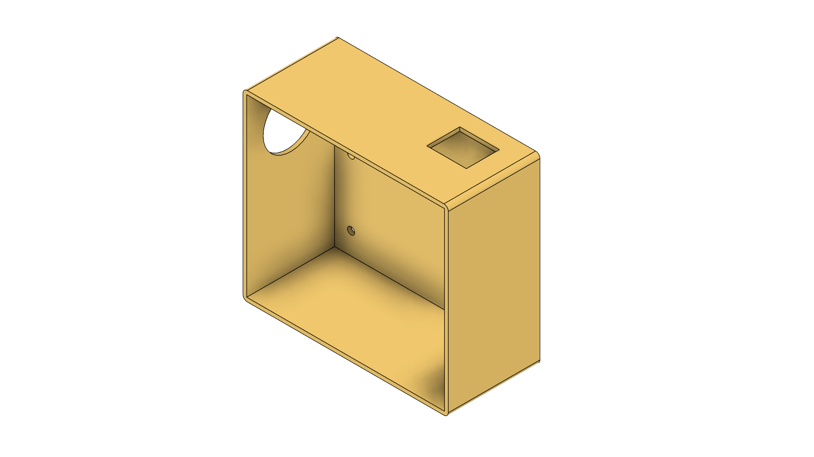
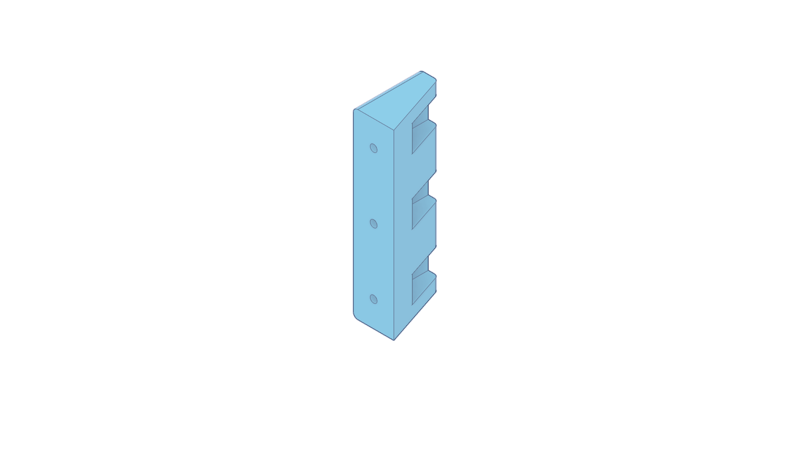
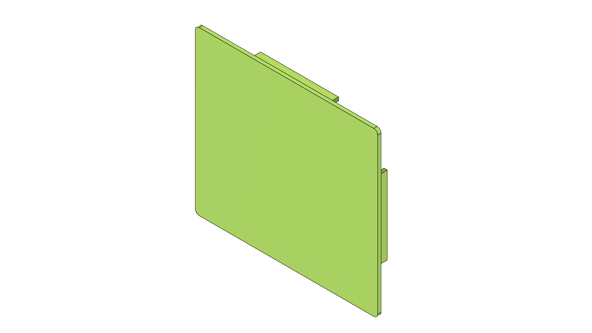
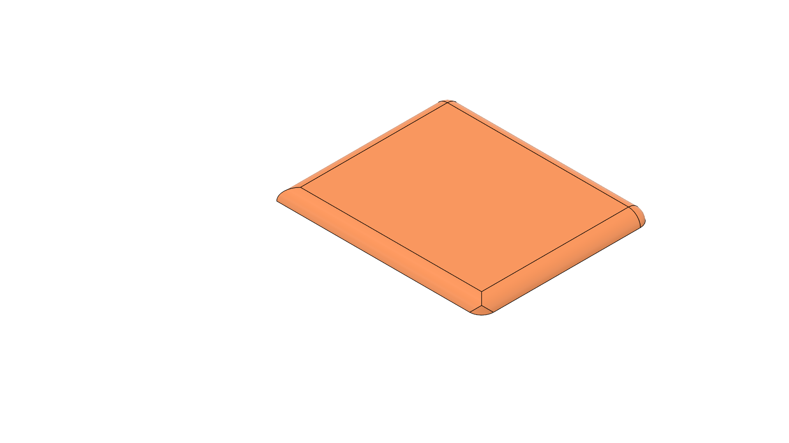
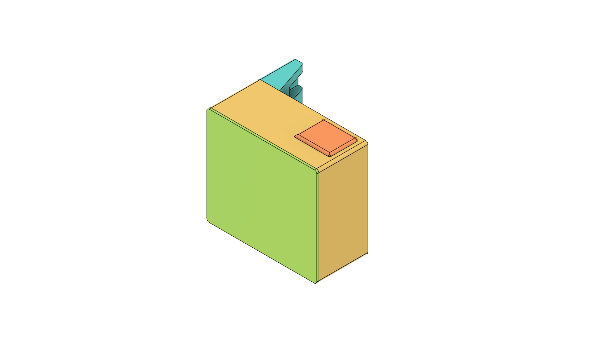

# Toolease

A comprehensive RFID-based tool leasing system built on ESP32 with real-time WebSocket communication. Designed for efficient, secure, and scalable tool management in educational, industrial, and enterprise environments.

---

## Table of Contents

- [Overview](#overview)
- [Key Features](#key-features)
- [System Architecture](#system-architecture)
- [Hardware Requirements](#hardware-requirements)
- [Wiring Diagram](#wiring-diagram)
- [3D Models](#3d-models)
- [Software Dependencies](#software-dependencies)
- [Installation & Setup](#installation--setup)
- [Configuration](#configuration)
- [Operation Guide](#operation-guide)
- [API & Communication](#api--communication)
- [Testing & Validation](#testing--validation)
- [Troubleshooting](#troubleshooting)
- [Project Structure](#project-structure)
- [Future Enhancements](#future-enhancements)
- [Contributing](#contributing)
- [Support & Contact](#support--contact)
- [License](#license)

---

## Overview

Toolease is an IoT solution for tool leasing and management, leveraging ESP32 microcontrollers and RFID technology. It enables real-time tracking, borrowing, and returning of tools, with seamless integration to mobile and web clients via WebSocket.

---

## Key Features

- **RFID Tag Reading/Writing** (EasyMFRC522)
- **Real-Time WebSocket Communication**
- **WiFi Access Point & Station Modes**
- **Serial Command Interface for Debugging**
- **Modular, Extensible Codebase**
- **Cross-Platform Client Support (Flutter, Web, etc.)**

---

## System Architecture

- **ESP32**: Central controller, RFID reader, WebSocket server
- **RFID (MFRC522)**: Tag identification and data storage
- **WebSocket**: Real-time, bidirectional communication with clients
- **Clients**: Flutter app, web dashboard, or other WebSocket-capable interfaces

---

## Hardware Requirements

- ESP32 development board
- MFRC522 RFID reader module
- MIFARE Classic RFID cards/tags
- Power supply (USB or regulated 3.3V/5V)
- Jumper wires, breadboard (for prototyping)

---

## Wiring Diagram

| MFRC522 Pin | ESP32 Pin (Example) |
|-------------|--------------------|
| SDA (SS)    | GPIO5              |
| SCK         | GPIO18             |
| MOSI        | GPIO23             |
| MISO        | GPIO19             |
| RST         | GPIO22             |
| 3.3V        | 3.3V               |
| GND         | GND                |

> Adjust pins in code if your hardware setup differs.

---

## 3D Models

The project includes 3D printable models for the RFID hardware casing, designed in Fusion 360 for easy assembly and protection of the ESP32 and MFRC522 components. These models are available in STL format for 3D printing and include visual previews. Tested with Creality Ender V3 SE printer using PLA+ filament.

### Individual Parts

- **Board Case**  
    
  The main enclosure that houses the ESP32 board, providing structural support and protection.  
  - **STL File:** Download from [Thingiverse](https://www.thingiverse.com/thing:7216344)  
  - **Material:** PLA+  
  - **Print Settings:** 0.2mm layer height, 20% infill, supports not required, bed 60°C, nozzle 210°C  

- **Bracket**  
    
  Mounting bracket for securely attaching the MFRC522 RFID reader module.  
  - **STL File:** Download from [Thingiverse](https://www.thingiverse.com/thing:7216344)  
  - **Material:** PLA+  
  - **Print Settings:** 0.2mm layer height, 30% infill, supports not required, bed 60°C, nozzle 210°C  

- **Case Cover**  
    
  Top cover for the board case, providing access to components and additional protection.  
  - **STL File:** Download from [Thingiverse](https://www.thingiverse.com/thing:7216344)  
  - **Material:** PLA+  
  - **Print Settings:** 0.2mm layer height, 20% infill, supports not required, bed 60°C, nozzle 210°C  

- **Port Cover**  
    
  Protective cover for the ESP32's USB and other ports, preventing dust and damage.  
  - **STL File:** Download from [Thingiverse](https://www.thingiverse.com/thing:7216344)  
  - **Material:** PLA+  
  - **Print Settings:** 0.2mm layer height, 20% infill, supports not required, bed 60°C, nozzle 210°C  

### Assembled View

- **All Parts Joined**  
    
  Complete assembly view showing how all individual parts fit together to form the full RFID casing. This model ensures proper alignment and fitment of all components.  
  - **Note:** This is a visual assembly guide; print individual STL files for actual parts.  

These 3D models are optimized for standard 3D printers and can be customized using software like Fusion 360. Ensure proper fitment with your specific ESP32 and MFRC522 modules before final assembly.

---

## Software Dependencies

- **Arduino IDE** (1.8.0+)
- **ESP32 Board Support** (via Boards Manager)
- **Libraries:**
  - EasyMFRC522 (by pablo-sampaio, v0.2.2 recommended)
  - WebSockets (by Markus Sattler)
  - WiFi (built-in)
  - Arduino core for ESP32

---

## Installation & Setup

1. **Clone the repository:**
   ```bash
   git clone https://github.com/qppd/Toolease.git
   cd Toolease
   ```

2. **Install Arduino IDE & ESP32 support:**
   - [Arduino IDE Download](https://www.arduino.cc/en/software)
   - [ESP32 Board Setup Guide](https://docs.espressif.com/projects/arduino-esp32/en/latest/installing.html)

3. **Install required libraries:**
   - Arduino IDE → Sketch → Include Library → Manage Libraries
   - Search and install:
     - "EasyMFRC522" by pablo-sampaio
     - "WebSockets" by Markus Sattler

4. **Open and configure the project:**
   - Open `source/esp32/Toolease/Toolease.ino`
   - Set WiFi credentials and pin assignments as needed

5. **Upload to ESP32:**
   - Select your ESP32 board and correct COM port
   - Click Upload

---

## Configuration

- **WiFi Credentials:**  
  Edit `Toolease.ino` to set your SSID and password.
- **RFID Pins:**  
  Adjust pin numbers in `Rfid_Config.h`/`.ino` to match your wiring.
- **Library Version:**  
  Use EasyMFRC522 v0.2.2 for best compatibility.

---

## Operation Guide

1. Power on the ESP32 device.
2. Connect to the WiFi AP (default: `ESP32_RFID`).
3. Use a WebSocket client to connect to `ws://<ESP32_IP>:81`.
4. Scan RFID tags to trigger broadcasts.
5. Use serial commands for testing/debugging.

---

## API & Communication

### WebSocket Message Types

- **RFID Scan Broadcast:**
  ```json
  {
    "type": "rfid_scan",
    "uid": "AA:BB:CC:DD"
  }
  ```
- **Write Request:**
  ```json
  {
    "action": "write_tag",
    "data": "tool_data_here"
  }
  ```
- **Write Response:**
  ```json
  {
    "action": "write_success",
    "data": "tool_data_here"
  }
  ```

### RFID Usage

- UID is read using `getUidString()` (colon-separated hex).
- Labeled data is managed with `writeFile`, `readFile`, `readFileSize`.

### Serial Commands

- `test` — Send a test RFID scan message
- `scan <uid>` — Send a specific UID scan message

---

## Testing & Validation

- Use serial monitor (115200 baud) for command testing.
- Validate RFID read/write with actual tags.
- Test WebSocket communication with a client (e.g., browser, Flutter app).

---

## Troubleshooting

- **No tag detected:** Check wiring, power, and tag type (MIFARE Classic).
- **WebSocket not connecting:** Verify WiFi connection and correct port.
- **Upload issues:** Ensure correct board/port selected in Arduino IDE.
- **Library errors:** Confirm EasyMFRC522 and WebSockets are installed and up to date.

---

## Project Structure

```
Toolease/
├── LICENSE
├── README.md
├── .gitignore
├── models/
│   ├── Toolease_Board_Case.png
│   ├── Toolease_Bracket.png
│   ├── Toolease_Case_Cover.png
│   ├── Toolease_Port_Cover.png
│   └── Toolease_Rfid_Casing_All_Parts_Joined.png
├── source/
│   └── esp32/
│       └── Toolease/
│           ├── Toolease.ino
│           ├── Rfid_Config.cpp/.h
│           ├── Websocket_Config.cpp/.h
└── wiring/
```

---

## Future Enhancements

- Cloud data sync and analytics
- User authentication and access control
- Mobile app with advanced features
- Support for additional RFID hardware
- Automated firmware updates

---

## Contributing

1. Fork the repository
2. Create a feature branch (`git checkout -b feature/YourFeature`)
3. Commit your changes (`git commit -m 'Add YourFeature'`)
4. Push to your branch (`git push origin feature/YourFeature`)
5. Open a Pull Request

---

## Support & Contact

- **Email:** quezon.province.pd@gmail.com
- **GitHub:** [qppd](https://github.com/qppd)
- **Portfolio:** [sajed-mendoza.onrender.com](https://sajed-mendoza.onrender.com)
- **Facebook:** [qppd.dev](https://facebook.com/qppd.dev)
- **Facebook Page:** [QUEZONPROVINCEDEVS](https://facebook.com/QUEZONPROVINCEDEVS)

---

## License

This project is licensed under the MIT License. See the [LICENSE](LICENSE) file for details.
- **Facebook:** https://facebook.com/qppd.dev
- **Facebook Page:** https://facebook.com/QUEZONPROVINCEDEVS

## Acknowledgments

- ESP32 community for excellent documentation and support
- Arduino framework developers
- Contributors to MFRC522 and WebSockets libraries